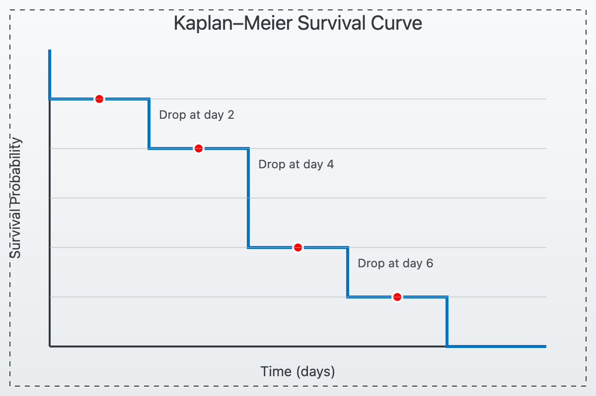
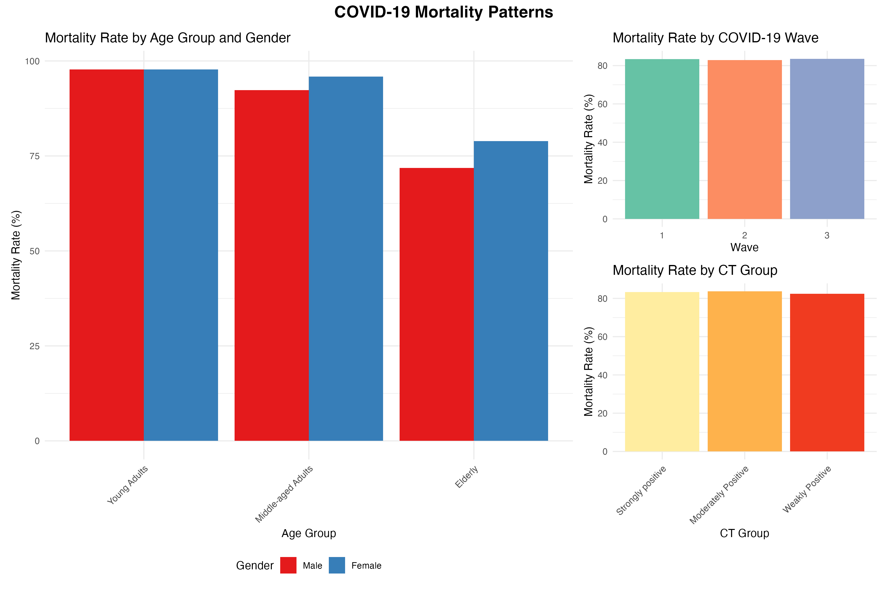

# COVID-19 Survival Analysis

This repository contains an analysis of COVID-19 patient data with a focus on hospital length of stay (LoS) and survival outcomes. The analysis explores relationships between patient characteristics, treatment waves, and mortality.

[](https://creativecommons.org/licenses/by-nc-nd/4.0/)




## Overview

This project includes:
- Exploratory data analysis of COVID-19 patient demographics
- Survival analysis using Kaplan-Meier estimates
- Statistical modeling (Cox proportional hazards, accelerated failure time models)
- Mixed-effects models accounting for hospital-level correlations

## Data

The analysis uses anonymized patient data with the following variables:
- Patient demographics (age, gender)
- Hospital stay information (length of stay, mortality)
- Clinical data (CT values)
- Hospital identifiers
- COVID-19 wave periods

## Repository Structure

```
covid-survival-analysis/
│
├── README.md                          # Project overview (this file)
├── LICENSE.md                         # CC BY 4.0 license
├── 00_run_analysis.R                  # Main runner script
├── data/
│   └── covid_sample_data.txt          # Source data file
├── scripts/
│   ├── 00_data-preprocessing.R        # Main script running the whole analysis
|   ├── 01-data-preprocessing.R        # Data loading and preprocessing
│   ├── 02-descriptive-analysis.R      # Descriptive statistics and visualizations
│   ├── 03-survival-analysis.R         # Non-parametric and semi-parametric models
│   ├── 04-parametric-models.R         # Parametric survival models
│   ├── 05-mixed-effects-models.R      # Mixed-effects models for clustering
│   └── 06-visualization.R             # Publication-quality visualizations
├── figures/                           # Generated visualizations
├── output/                            # Analysis results
├── models/                            # Saved model objects
└── logs/                              # Analysis logs
```

## Requirements

This analysis requires R with the following packages:
- dplyr, tidyverse - Data manipulation
- survival, survminer, flexsurv - Survival analysis
- ggplot2, patchwork, RColorBrewer - Visualization
- coxme, lme4 - Mixed-effects models
- gtsummary, sjPlot - Results presentation
- car, MASS - Statistical functions
- Other helpers: rio, gmodels, rstanarm, ranger, randomForestSRC

## Analysis Workflow

1. **Data Preprocessing** (01-data-preprocessing.r)
   - Load and clean the COVID-19 data
   - Create age groups, CT value categories
   - Generate demographic summaries

2. **Descriptive Analysis** (02-descriptive-analysis.r)
   - Create demographic visualizations
   - Generate cross-tabulations
   - Examine distributions of key variables

3. **Survival Analysis** (03-survival-analysis.r)
   - Perform Kaplan-Meier analysis by various factors
   - Fit Cox proportional hazards models
   - Test model assumptions

4. **Parametric Models** (04-parametric-models.r)
   - Compare different parametric distributions
   - Fit Accelerated Failure Time (AFT) models
   - Perform model selection

5. **Mixed-Effects Models** (05-mixed-effects-models.R)
   - Account for hospital-level clustering
   - Analyze hospital random effects
   - Examine variation in outcomes

6. **Visualization** (06-visualization.R)
   - Create publication-quality figures
   - Generate comprehensive visualizations
   - Prepare results for presentation

## Usage

1. Clone this repository
2. Place the data file in the `/data` directory
3. Run the analysis with the main script:

```r
# Install required packages if needed
if (!require("pacman")) install.packages("pacman")

# Run the complete analysis
source("scripts/00-run-analysis.R")
```

Alternatively, you can run each script individually in sequence:

```r
source("scripts/01-data-preprocessing.R")
source("scripts/02-descriptive-analysis.R")
# ... and so on
```

## Results

Key findings include:
- Age-stratified mortality patterns in COVID-19 patients
- Gender differences in survival outcomes
- Effect of COVID-19 waves on patient outcomes
- Hospital-level random effects on length of stay



## License

Survival Analysis Github Repository © 2025 by Geoffrey Manda is licensed under a [Creative Commons Attribution 4.0 International License](https://creativecommons.org/licenses/by/4.0/).

You are free to:
- Share — copy and redistribute the material in any medium or format
- Adapt — remix, transform, and build upon the material for any purpose, even commercially.

Under the following terms:
- Attribution — You must give appropriate credit to Geoffrey Manda, provide a link to the license, and indicate if changes were made.

## Contact

Geoffrey Manda 
LinkedIn: [https://www.linkedin.com/in/geoffreymanda/](https://www.linkedin.com/in/geoffreymanda/)
GitHub: [https://github.com/GeoffreyManda](https://github.com/GeoffreyManda)
