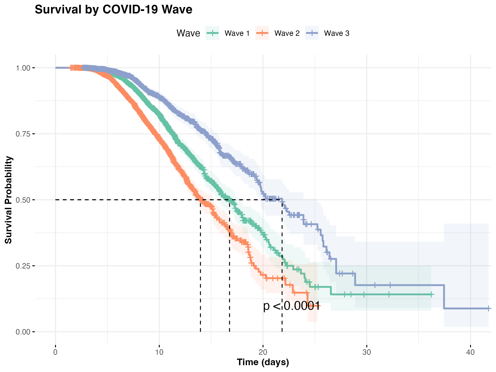

# COVID-19 Survival Analysis

This project analyzes COVID-19 patient data to investigate factors influencing hospital length of stay and mortality outcomes.

## Key Findings

- Age-stratified mortality patterns in COVID-19 patients
- Gender differences in survival outcomes
- Effect of COVID-19 waves on patient outcomes
- Hospital-level random effects on length of stay

## Analysis Components

1. [Data Preprocessing](https://github.com/GeoffreyManda/covid-survival-analysis/blob/main/01_data_preprocessing.R)
2. [Descriptive Analysis](https://github.com/GeoffreyManda/covid-survival-analysis/blob/main/02_descriptive_analysis.R)
3. [Survival Analysis](https://github.com/GeoffreyManda/covid-survival-analysis/blob/main/03_survival_analysis.R)
4. [Parametric Models](https://github.com/GeoffreyManda/covid-survival-analysis/blob/main/04_parametric_models.R)
5. [Mixed-Effects Models](https://github.com/GeoffreyManda/covid-survival-analysis/blob/main/05_mixed_effects_models.R)
6. [Visualizations](https://github.com/GeoffreyManda/covid-survival-analysis/blob/main/06_visualization.R)

## Full Report

The complete analysis is available as an [R Markdown document](https://github.com/GeoffreyManda/covid-survival-analysis/blob/main/COVID19_Survival_Analysis.Rmd).

## Author

Geoffrey Manda
GitHub: [https://github.com/GeoffreyManda](https://github.com/GeoffreyManda)

